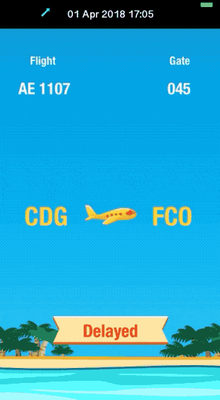
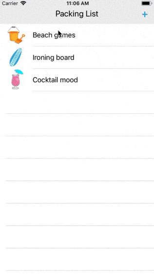
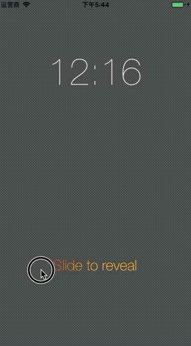
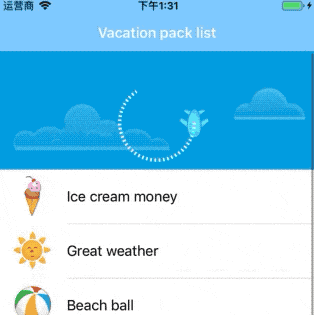
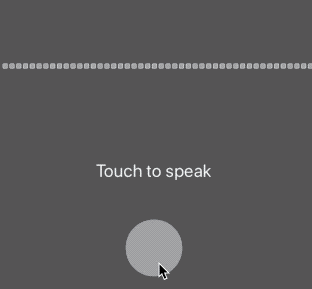
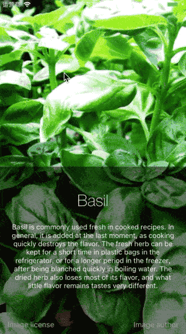
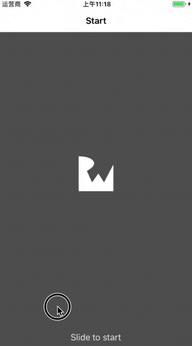
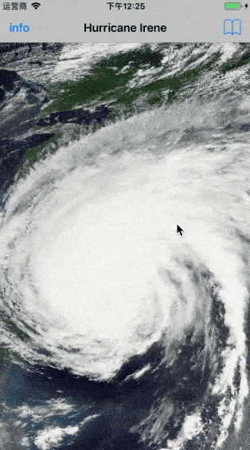
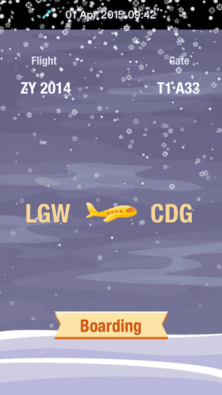
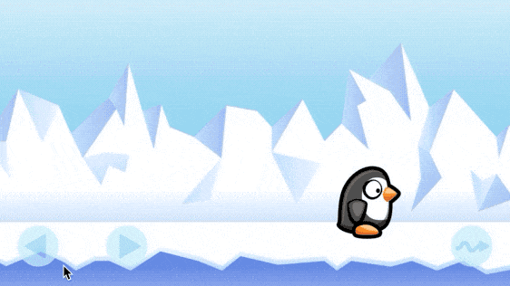

LearniOSAnimations
------------------
iOS动画学习

## [系统学习iOS动画](iOS_Animations_by_Tutorials/README.md)🤞🏼

[系统学习iOS动画](iOS_Animations_by_Tutorials/README.md)是学习[《iOS Animations by Tutorials》](https://store.raywenderlich.com/products/ios-animations-by-tutorials) 的笔记。

[系统学习iOS动画之零：说明和目录](iOS_Animations_by_Tutorials/)   
[系统学习iOS动画之一：视图动画](iOS_Animations_by_Tutorials/Section_I.md)   
[系统学习iOS动画之二：自动布局](iOS_Animations_by_Tutorials/Section_II.md)  
[系统学习iOS动画之三：图层动画](iOS_Animations_by_Tutorials/Section_III.md)  
[系统学习iOS动画之四：视图控制器的转场](iOS_Animations_by_Tutorials/Section_IV.md)  
[系统学习iOS动画之五：使用UIViewPropertyAnimator](iOS_Animations_by_Tutorials/Section_V.md)   
[系统学习iOS动画之六：3D动画](iOS_Animations_by_Tutorials/Section_VI.md)  
[系统学习iOS动画之七：其它类型的动画](iOS_Animations_by_Tutorials/Section_VII.md)    

项目预览：

|项目名      |  BahamaAirLoginScreen   |  Flight Info    |  Packing List  |
| ---- 		| :----: | :----: | :--------------------------------------------: |
| 预览图     |      |      |   |

|项目名      |  MultiplayerSearch   |  SlideToReveal    |  PullToRefresh  |
| ---- 		| :----: | :----: | :--------------------------------------------: |
| 预览图     |   |      |   |

|项目名      |   Lris  |  BeginnerCook    |  LogoReveal   |
| ---- 		| :----: | :----: | :--------------------------------------------: |
| 预览图     |    |     |  |

|项目名      |   LockSearch  |  OfficeBuddy    |  ImageGallery   |
| ---- 		| :----: | :----: | :--------------------------------------------: |
| 预览图     |  |    |      |

|项目名      |  Snow Scene   |  SouthPoleFun    |
| ---- 		| :----: | :----: |
| 预览图     |     |    |

## 其它学习资源

《iOS Core Animation: Advanced Techniques》是iOS动画高级技巧。

转场动画
https://blog.devtang.com/2016/03/13/iOS-transition-guide/

